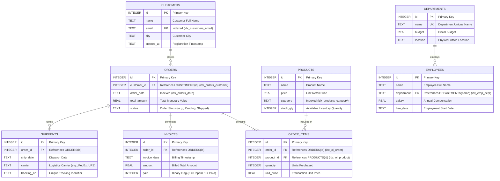
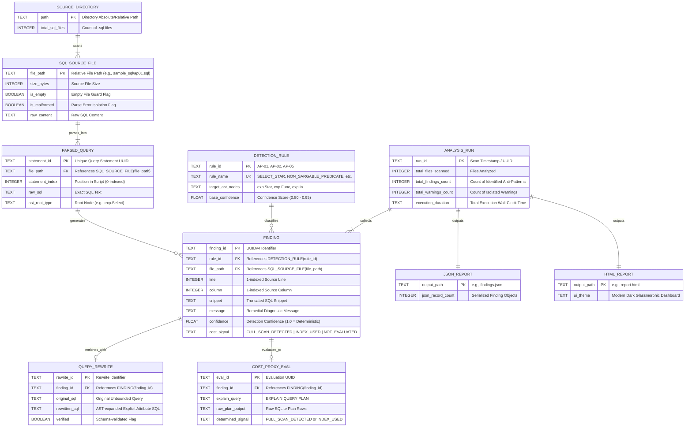

# Database Entity-Relationship (E-R) Diagram & Relational Schema Specification

This document provides the formal **Entity-Relationship (E-R) Diagrams** and **Relational Schemas** for the SQL Anti-Pattern Detection and Query Optimization project. 

The project contains two distinct operational components:
1. **Component 1: Target Database Relational Schema (The Benchmark/Catalog Domain)** — The 8-table enterprise relational model analyzed by the AST engine, rewritten by the schema catalog, and evaluated via SQLite's `EXPLAIN QUERY PLAN`.
2. **Component 2: Static Analysis Engine Meta-Schema (The Tool's Internal Data Model)** — The entity structure of the static code analyzer, including AST nodes, detection rules, finding objects, rewrites, cost signals, and reporting outputs.

---

## Component 1: Target Database Relational Model

The target schema represents an enterprise commercial platform consisting of 8 relational tables. This schema serves as the foundation for:
- **Rule Detection Verification:** Testing sargability of queries on indexed vs unindexed attributes.
- **AST Query Rewriting (`engine/rewriter.py`):** Expanding `SELECT *` into schema-qualified column projections using `SCHEMA_MAP`.
- **In-Memory Cost Plan Proxy (`engine/cost_proxy.py`):** Seeding an in-memory SQLite catalog with B-Tree indexes to evaluate `SCAN` vs `SEARCH` operations.

### 1.1 Conceptual E-R Diagram (Crow's Foot Notation)



---

### 1.2 Formal Relational Schema (Database Theory Notation)

In formal relational database design notation, primary keys are **<u>underlined</u>**, foreign keys are marked with an arrow ($\to$), and attribute domains are explicitly defined:

1. **`CUSTOMERS`** (
   **<u>`id`</u>**: `INTEGER`, 
   `name`: `TEXT`, 
   `email`: `TEXT` [UNIQUE], 
   `city`: `TEXT`, 
   `created_at`: `TEXT`
   )

2. **`ORDERS`** (
   **<u>`id`</u>**: `INTEGER`, 
   `customer_id`: `INTEGER` $\to$ `CUSTOMERS`(`id`), 
   `order_date`: `TEXT`, 
   `total_amount`: `REAL`, 
   `status`: `TEXT`
   )

3. **`PRODUCTS`** (
   **<u>`id`</u>**: `INTEGER`, 
   `name`: `TEXT`, 
   `price`: `REAL`, 
   `category`: `TEXT`, 
   `stock_qty`: `INTEGER`
   )

4. **`ORDER_ITEMS`** (
   **<u>`id`</u>**: `INTEGER`, 
   `order_id`: `INTEGER` $\to$ `ORDERS`(`id`), 
   `product_id`: `INTEGER` $\to$ `PRODUCTS`(`id`), 
   `quantity`: `INTEGER`, 
   `unit_price`: `REAL`
   )

5. **`INVOICES`** (
   **<u>`id`</u>**: `INTEGER`, 
   `order_id`: `INTEGER` $\to$ `ORDERS`(`id`), 
   `invoice_date`: `TEXT`, 
   `amount`: `REAL`, 
   `paid`: `INTEGER`
   )

6. **`SHIPMENTS`** (
   **<u>`id`</u>**: `INTEGER`, 
   `order_id`: `INTEGER` $\to$ `ORDERS`(`id`), 
   `ship_date`: `TEXT`, 
   `carrier`: `TEXT`, 
   `tracking_no`: `TEXT`
   )

7. **`DEPARTMENTS`** (
   **<u>`id`</u>**: `INTEGER`, 
   `name`: `TEXT` [UNIQUE], 
   `budget`: `REAL`, 
   `location`: `TEXT`
   )

8. **`EMPLOYEES`** (
   **<u>`id`</u>**: `INTEGER`, 
   `name`: `TEXT`, 
   `department`: `TEXT` $\to$ `DEPARTMENTS`(`name`), 
   `salary`: `REAL`, 
   `hire_date`: `TEXT`
   )

---

### 1.3 Referential Integrity and Cardinality Constraints

| Relationship | Parent Entity | Child Entity | Cardinality | Foreign Key | Cascade Policy |
|---|---|---|:---:|---|---|
| **Customer Placement** | `CUSTOMERS` | `ORDERS` | $1 : N$ | `orders.customer_id` $\to$ `customers.id` | RESTRICT / CASCADE |
| **Order Line Items** | `ORDERS` | `ORDER_ITEMS` | $1 : N$ | `order_items.order_id` $\to$ `orders.id` | CASCADE |
| **Product Fulfillment** | `PRODUCTS` | `ORDER_ITEMS` | $1 : N$ | `order_items.product_id` $\to$ `products.id` | RESTRICT |
| **Order Invoicing** | `ORDERS` | `INVOICES` | $1 : 1$ (or $1 : N$) | `invoices.order_id` $\to$ `orders.id` | CASCADE |
| **Order Logistics** | `ORDERS` | `SHIPMENTS` | $1 : N$ | `shipments.order_id` $\to$ `orders.id` | CASCADE |
| **Department Staffing**| `DEPARTMENTS` | `EMPLOYEES` | $1 : N$ | `employees.department` $\to$ `departments.name`| RESTRICT / SET NULL|

*Note: The relationship between `ORDERS` and `PRODUCTS` is a canonical **Many-to-Many ($M:N$)** relationship, fully resolved via the junction associative entity `ORDER_ITEMS`.*

---

### 1.4 Physical DDL Schema with Secondary B-Tree Indexes

This physical Data Definition Language (DDL) matches the in-memory execution plan generator implemented in [`engine/cost_proxy.py`](file:///c:/Users/ARADHYA%20RAHUL%20PANDEY/OneDrive/Desktop/ADBV%20SQL/engine/cost_proxy.py):

```sql
-- 1. Customers Table
CREATE TABLE customers (
    id INTEGER PRIMARY KEY,
    name TEXT NOT NULL,
    email TEXT UNIQUE NOT NULL,
    city TEXT NOT NULL,
    created_at TEXT NOT NULL
);
CREATE INDEX idx_customers_email ON customers(email);

-- 2. Orders Table
CREATE TABLE orders (
    id INTEGER PRIMARY KEY,
    customer_id INTEGER NOT NULL,
    order_date TEXT NOT NULL,
    total_amount REAL NOT NULL,
    status TEXT NOT NULL,
    FOREIGN KEY (customer_id) REFERENCES customers(id)
);
CREATE INDEX idx_orders_customer ON orders(customer_id);
CREATE INDEX idx_orders_date ON orders(order_date);

-- 3. Products Table
CREATE TABLE products (
    id INTEGER PRIMARY KEY,
    name TEXT NOT NULL,
    price REAL NOT NULL,
    category TEXT NOT NULL,
    stock_qty INTEGER NOT NULL
);
CREATE INDEX idx_products_category ON products(category);

-- 4. Order Items (Junction Table)
CREATE TABLE order_items (
    id INTEGER PRIMARY KEY,
    order_id INTEGER NOT NULL,
    product_id INTEGER NOT NULL,
    quantity INTEGER NOT NULL,
    unit_price REAL NOT NULL,
    FOREIGN KEY (order_id) REFERENCES orders(id),
    FOREIGN KEY (product_id) REFERENCES products(id)
);
CREATE INDEX idx_oi_order ON order_items(order_id);
CREATE INDEX idx_oi_product ON order_items(product_id);

-- 5. Invoices Table
CREATE TABLE invoices (
    id INTEGER PRIMARY KEY,
    order_id INTEGER NOT NULL,
    invoice_date TEXT NOT NULL,
    amount REAL NOT NULL,
    paid INTEGER NOT NULL DEFAULT 0,
    FOREIGN KEY (order_id) REFERENCES orders(id)
);

-- 6. Shipments Table
CREATE TABLE shipments (
    id INTEGER PRIMARY KEY,
    order_id INTEGER NOT NULL,
    ship_date TEXT NOT NULL,
    carrier TEXT NOT NULL,
    tracking_no TEXT NOT NULL,
    FOREIGN KEY (order_id) REFERENCES orders(id)
);

-- 7. Departments Table
CREATE TABLE departments (
    id INTEGER PRIMARY KEY,
    name TEXT UNIQUE NOT NULL,
    budget REAL NOT NULL,
    location TEXT NOT NULL
);

-- 8. Employees Table
CREATE TABLE employees (
    id INTEGER PRIMARY KEY,
    name TEXT NOT NULL,
    department TEXT NOT NULL,
    salary REAL NOT NULL,
    hire_date TEXT NOT NULL,
    FOREIGN KEY (department) REFERENCES departments(name)
);
CREATE INDEX idx_emp_dept ON employees(department);
```

---

### 1.5 Index & Anti-Pattern Sargability Matrix

The secondary indexes in this schema are directly used to demonstrate query optimizer degradation in our research paper:

| Index Name | Target Relation | Key Column | Intended Optimizer Path | Anti-Pattern Triggering Full Scan (`FULL_SCAN_DETECTED`) |
|---|---|---|---|---|
| `idx_customers_email` | `customers` | `email` | Index Seek / Range Scan | `WHERE TRIM(email) = ?` or `WHERE LOWER(email) = ?` |
| `idx_orders_customer` | `orders` | `customer_id` | Foreign Key Index Join | `ON COALESCE(o.customer_id, 0) = c.id` |
| `idx_orders_date` | `orders` | `order_date` | Date Range B-Tree Seek | `WHERE YEAR(order_date) = 2024` or `STRFTIME(...)` |
| `idx_products_category`| `products` | `category` | Category Filter Seek | `WHERE UPPER(category) = 'ELECTRONICS'` |
| `idx_emp_dept` | `employees` | `department` | Index-Assisted Semi-Join | `WHERE department IN (SELECT name FROM departments)` |

---

## Component 2: Static Analysis Engine Meta-Schema

The second component models the static analysis pipeline itself. When the CLI runner scans a directory of SQL scripts, it builds and maintains an internal entity graph mapping SQL source scripts to parsed AST trees, anti-pattern rules, findings, rewrites, execution plan evaluations, and serialized reports.

### 2.1 Static Analysis Engine Meta-ER Diagram



---

### 2.2 Formal Meta-Relational Schema

1. **`SQL_SOURCE_FILE`** (
   **<u>`file_path`</u>**: `TEXT`, 
   `size_bytes`: `INTEGER`, 
   `is_empty`: `BOOLEAN`, 
   `is_malformed`: `BOOLEAN`, 
   `raw_content`: `TEXT`
   )

2. **`PARSED_QUERY`** (
   **<u>`statement_id`</u>**: `TEXT`, 
   `file_path`: `TEXT` $\to$ `SQL_SOURCE_FILE`(`file_path`), 
   `statement_index`: `INTEGER`, 
   `raw_sql`: `TEXT`, 
   `ast_root_type`: `TEXT`
   )

3. **`DETECTION_RULE`** (
   **<u>`rule_id`</u>**: `TEXT`, 
   `rule_name`: `TEXT` [UNIQUE], 
   `target_ast_nodes`: `TEXT`, 
   `base_confidence`: `REAL`
   )

4. **`FINDING`** (
   **<u>`finding_id`</u>**: `TEXT`, 
   `rule_id`: `TEXT` $\to$ `DETECTION_RULE`(`rule_id`), 
   `file_path`: `TEXT` $\to$ `SQL_SOURCE_FILE`(`file_path`), 
   `line`: `INTEGER`, 
   `column`: `INTEGER`, 
   `snippet`: `TEXT`, 
   `message`: `TEXT`, 
   `confidence`: `REAL`, 
   `cost_signal`: `TEXT`
   )

5. **`QUERY_REWRITE`** (
   **<u>`rewrite_id`</u>**: `TEXT`, 
   `finding_id`: `TEXT` $\to$ `FINDING`(`finding_id`), 
   `original_sql`: `TEXT`, 
   `rewritten_sql`: `TEXT`, 
   `verified`: `BOOLEAN`
   )

6. **`COST_PROXY_EVAL`** (
   **<u>`eval_id`</u>**: `TEXT`, 
   `finding_id`: `TEXT` $\to$ `FINDING`(`finding_id`), 
   `explain_query`: `TEXT`, 
   `raw_plan_output`: `TEXT`, 
   `determined_signal`: `TEXT`
   )

7. **`ANALYSIS_RUN`** (
   **<u>`run_id`</u>**: `TEXT`, 
   `total_files_scanned`: `INTEGER`, 
   `total_findings_count`: `INTEGER`, 
   `total_warnings_count`: `INTEGER`, 
   `execution_duration`: `TEXT`
   )

---

## 3. LaTeX Representation for Academic Publication / IEEE Paper Generation

If you need to include the relational schema in [`research_paper.tex`](file:///c:/Users/ARADHYA%20RAHUL%20PANDEY/OneDrive/Desktop/ADBV%20SQL/research_paper.tex), you can directly insert the following IEEE-formatted table snippet:

```latex
\begin{table}[htbp]
\caption{Benchmark Evaluation Relational Schema and Indexing Topology}
\label{tab:relational_schema}
\centering
\footnotesize
\begin{tabular}{lll}
\toprule
\textbf{Relation} & \textbf{Attributes (Primary Key Underlined)} & \textbf{Secondary B-Tree Indexes} \\
\midrule
\texttt{customers} & \underline{\texttt{id}}, \texttt{name}, \texttt{email}, \texttt{city}, \texttt{created\_at} & \texttt{idx\_customers\_email (email)} \\
\texttt{orders} & \underline{\texttt{id}}, \texttt{customer\_id}$^*$, \texttt{order\_date}, \texttt{total\_amount}, \texttt{status} & \texttt{idx\_orders\_customer}, \texttt{idx\_orders\_date} \\
\texttt{products} & \underline{\texttt{id}}, \texttt{name}, \texttt{price}, \texttt{category}, \texttt{stock\_qty} & \texttt{idx\_products\_category (category)} \\
\texttt{order\_items} & \underline{\texttt{id}}, \texttt{order\_id}$^*$, \texttt{product\_id}$^*$, \texttt{quantity}, \texttt{unit\_price} & \texttt{idx\_oi\_order}, \texttt{idx\_oi\_product} \\
\texttt{invoices} & \underline{\texttt{id}}, \texttt{order\_id}$^*$, \texttt{invoice\_date}, \texttt{amount}, \texttt{paid} & --- \\
\texttt{shipments} & \underline{\texttt{id}}, \texttt{order\_id}$^*$, \texttt{ship\_date}, \texttt{carrier}, \texttt{tracking\_no} & --- \\
\texttt{departments} & \underline{\texttt{id}}, \texttt{name}, \texttt{budget}, \texttt{location} & \texttt{departments\_name\_unique} \\
\texttt{employees} & \underline{\texttt{id}}, \texttt{name}, \texttt{department}$^*$, \texttt{salary}, \texttt{hire\_date} & \texttt{idx\_emp\_dept (department)} \\
\bottomrule
\multicolumn{3}{l}{$^*$Denotes foreign key constraint referencing respective parent relations.}
\end{tabular}
\end{table}
```
